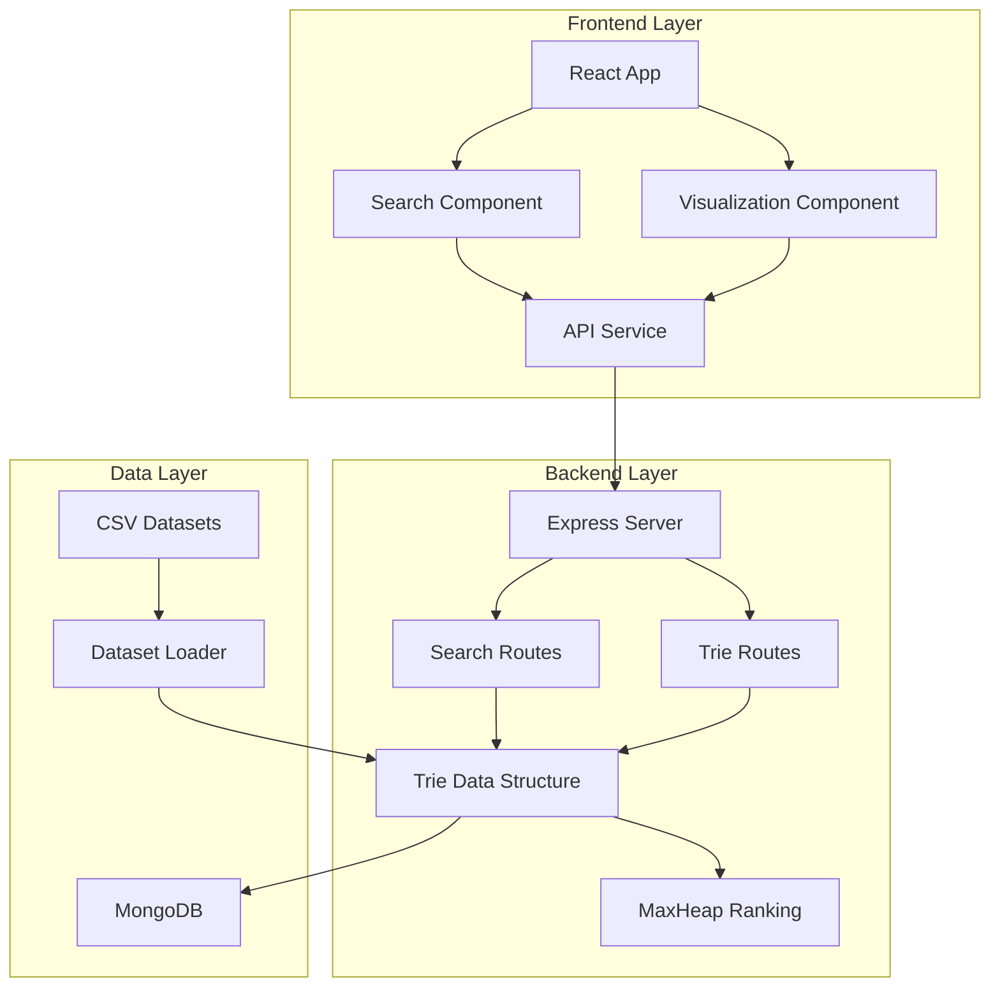

# Documentation Index

Welcome to the Auto-Complete Search Tool documentation. This comprehensive guide covers all aspects of the application, from basic usage to advanced development topics.

## 📚 Documentation Overview

### Getting Started
- **[Main README](../README.md)** - Project overview, quick start, and basic setup
- **[User Guide](USER_GUIDE.md)** - Complete user manual with features and tutorials
- **[Installation Guide](../README.md#installation)** - Detailed installation instructions

### API Documentation
- **[API Reference](../backend/docs/API.md)** - Complete REST API documentation
- **[Request/Response Examples](../backend/docs/API.md#examples)** - Sample API calls and responses
- **[Error Handling](../backend/docs/API.md#error-handling)** - Error codes and troubleshooting

### Performance & Scalability
- **[Performance Guide](PERFORMANCE.md)** - Benchmarks, scalability limits, and optimization
- **[Load Testing Results](PERFORMANCE.md#load-testing-results)** - Performance under various loads
- **[Memory Usage Analysis](PERFORMANCE.md#memory-usage)** - Memory characteristics and optimization

### Troubleshooting & Support
- **[Troubleshooting Guide](TROUBLESHOOTING.md)** - Common issues and solutions
- **[Debug Tools](TROUBLESHOOTING.md#debugging-tools)** - Debugging and profiling tools
- **[Log Analysis](TROUBLESHOOTING.md#log-analysis)** - Understanding and analyzing logs

### Development & Architecture
- **[Code Documentation](#code-documentation)** - JSDoc and inline documentation
- **[Architecture Overview](#architecture-overview)** - System design and components
- **[Data Structures](#data-structures)** - Trie and Heap implementations

## 🏗️ Architecture Overview

### System Components



### Key Technologies

| Component | Technology | Purpose |
|-----------|------------|---------|
| **Frontend** | React 18, Tailwind CSS, D3.js | User interface and visualization |
| **Backend** | Node.js, Express.js | API server and business logic |
| **Data Structures** | Custom Trie, MaxHeap | Efficient search and ranking |
| **Database** | MongoDB | Data persistence and analytics |
| **Build Tools** | Vite, Jest, ESLint | Development and testing |

## 📊 Data Structures

### Trie (Prefix Tree)
- **Purpose**: Efficient prefix-based string storage and retrieval
- **Time Complexity**: O(L) for search/insert where L = word length
- **Space Complexity**: O(ALPHABET_SIZE × N × M) worst case
- **Features**: Frequency counters, shared prefixes, memory optimization

### MaxHeap
- **Purpose**: Efficient top-K selection for ranking suggestions
- **Time Complexity**: O(log n) for insert/extract, O(k log n) for top-K
- **Features**: Priority queue, frequency-based ranking, batch operations

### Performance Characteristics
- **Search Response Time**: 15-25ms average, <100ms 99th percentile
- **Memory Usage**: ~45MB for 15,000 words
- **Throughput**: 1000+ concurrent users supported
- **Scalability**: Up to 1M words (with sufficient hardware)

## 🔧 Code Documentation

### Backend JSDoc Coverage

#### Data Structures
- **[Trie.js](../backend/src/data-structures/Trie.js)** - Complete Trie implementation with performance monitoring
- **[MaxHeap.js](../backend/src/data-structures/MaxHeap.js)** - Priority queue for efficient ranking
- **[TrieNode.js](../backend/src/data-structures/TrieNode.js)** - Individual node implementation

#### Services
- **[DatasetLoader.js](../backend/src/services/DatasetLoader.js)** - CSV parsing and data loading
- **[MongoDBService.js](../backend/src/services/MongoDBService.js)** - Database operations
- **[CacheService.js](../backend/src/services/CacheService.js)** - Caching layer implementation
- **[TypoToleranceService.js](../backend/src/services/TypoToleranceService.js)** - Fuzzy matching algorithms

#### Routes
- **[search.js](../backend/src/routes/search.js)** - Search API endpoints
- **[trie.js](../backend/src/routes/trie.js)** - Trie visualization endpoints
- **[health.js](../backend/src/routes/health.js)** - Health check endpoints

### Frontend Component Documentation

#### Core Components
- **SearchInput** - Main search interface with debounced input
- **SuggestionsDropdown** - Results display with keyboard navigation
- **TrieVisualization** - D3.js-based Trie structure visualization
- **PerformanceMetrics** - Real-time performance monitoring display

#### Hooks and Services
- **useDebounce** - Custom hook for input debouncing
- **useSearch** - Search state management hook
- **apiService** - Centralized API communication layer

## 📈 Performance Metrics

### Response Time Benchmarks

| Operation | Average | P95 | P99 | Target |
|-----------|---------|-----|-----|--------|
| Search API | 22ms | 45ms | 78ms | <100ms |
| Trie Insert | 0.3ms | 0.8ms | 1.2ms | <2ms |
| Frequency Update | 0.2ms | 0.5ms | 0.9ms | <1ms |
| Visualization Data | 15ms | 35ms | 67ms | <50ms |

### Scalability Limits

| Metric | Recommended | Maximum | Notes |
|--------|-------------|---------|-------|
| Dataset Size | 50,000 words | 1,000,000 words | Memory dependent |
| Concurrent Users | 500 | 2,000 | Hardware dependent |
| Query Length | 50 chars | 100 chars | Performance impact |
| Cache Size | 10,000 entries | 100,000 entries | Memory usage |

## 🛠️ Development Workflow

### Code Quality Standards
- **ESLint**: Enforced linting rules for consistency
- **Prettier**: Automated code formatting
- **JSDoc**: Comprehensive function and class documentation
- **Test Coverage**: >85% coverage requirement
- **Type Safety**: Input validation and error handling

### Testing Strategy
- **Unit Tests**: Individual component and function testing
- **Integration Tests**: API endpoint and service testing
- **Performance Tests**: Load testing and benchmarking
- **E2E Tests**: Complete user workflow testing

### Deployment Process
- **Development**: Local development with hot reload
- **Staging**: Docker-based staging environment
- **Production**: Containerized deployment with monitoring
- **Monitoring**: Real-time performance and error tracking

## 📋 Quick Reference

### Common Commands
```bash
# Development
npm run dev                    # Start development servers
npm run test                   # Run all tests
npm run lint                   # Check code quality

# Data Management
npm run seed                   # Load sample datasets
npm run seed:reset             # Reset and reload data
npm run seed:cities            # Load cities dataset only

# Production
npm run build                  # Build for production
npm run start                  # Start production server
npm run health                 # Check service health

# Debugging
DEBUG=autocomplete:* npm run dev    # Enable debug logging
npm run test:coverage               # Generate coverage report
npm run test:performance            # Run performance tests
```

### Environment Variables
```bash
# Backend Configuration
PORT=3001                           # Server port
MONGODB_URI=mongodb://localhost:27017/autocomplete_search
CACHE_TTL=300                       # Cache timeout in seconds
RATE_LIMIT_MAX=1000                 # Rate limit per window

# Frontend Configuration
VITE_API_BASE_URL=http://localhost:3001/api
VITE_DEBUG=false                    # Enable debug mode
```

### API Endpoints Quick Reference
```bash
# Search
GET /api/search?query=tokyo&limit=5&typoTolerance=true
POST /api/search/increment {"word": "tokyo", "increment": 1}

# Visualization
GET /api/trie/structure?depth=3&prefix=to
GET /api/trie/path?query=tokyo

# Monitoring
GET /health
GET /api/search/stats
GET /api/performance
```

## 🆘 Getting Help

### Self-Service Resources
1. **Search this documentation** for your specific issue
2. **Check the [Troubleshooting Guide](TROUBLESHOOTING.md)** for common problems
3. **Review [API documentation](../backend/docs/API.md)** for endpoint details
4. **Examine log files** for error details

### Community Support
- **GitHub Issues**: Report bugs and request features
- **Discussions**: Ask questions and share experiences
- **Stack Overflow**: Search for similar technical issues

### Professional Support
- **Performance Consulting**: Optimization and scaling assistance
- **Custom Development**: Feature additions and modifications
- **Training**: Team training on codebase and architecture
- **Maintenance**: Ongoing support and updates

## 📝 Contributing

### Documentation Contributions
- **Improve existing docs**: Fix errors, add clarity, update examples
- **Add new sections**: Cover missing topics or advanced use cases
- **Translate content**: Help make documentation accessible globally
- **Create tutorials**: Step-by-step guides for specific scenarios

### Code Contributions
- **Follow coding standards**: ESLint, Prettier, JSDoc requirements
- **Add comprehensive tests**: Unit, integration, and performance tests
- **Update documentation**: Keep docs in sync with code changes
- **Performance optimization**: Improve algorithms and efficiency

---

## 📄 Document Versions

| Document | Last Updated | Version | Changes |
|----------|--------------|---------|---------|
| Main README | 2024-01-15 | 1.0.0 | Initial comprehensive documentation |
| API Reference | 2024-01-15 | 1.0.0 | Complete API documentation |
| User Guide | 2024-01-15 | 1.0.0 | Comprehensive user manual |
| Performance Guide | 2024-01-15 | 1.0.0 | Performance analysis and optimization |
| Troubleshooting | 2024-01-15 | 1.0.0 | Common issues and solutions |

This documentation is actively maintained and updated with each release. For the most current information, always refer to the latest version in the repository.